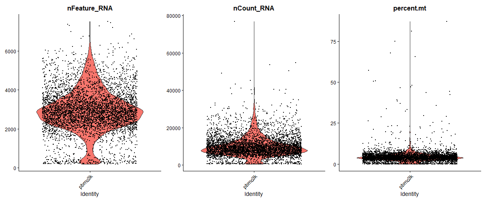
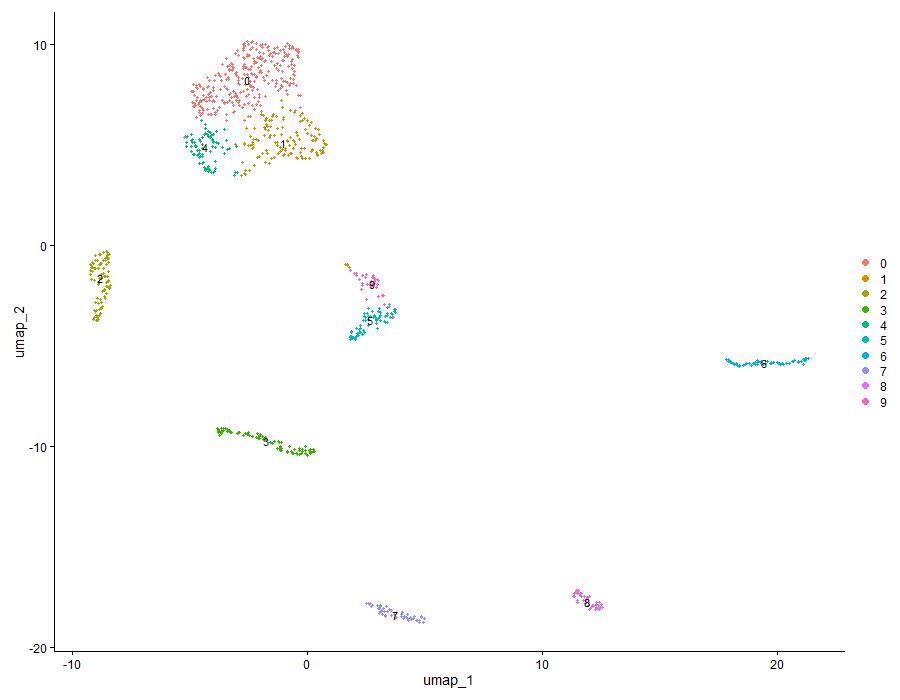
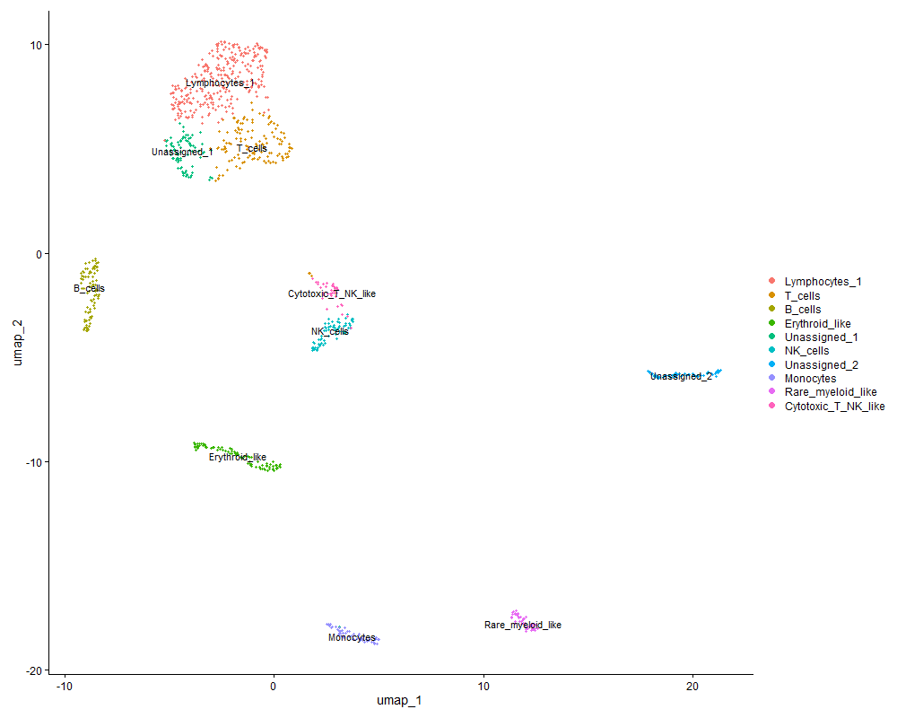
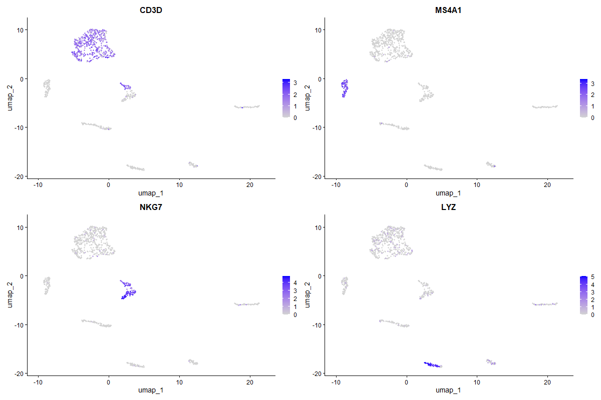

# 🧬 Single-Cell RNA-seq Analysis of PBMC Immune Cells (Seurat)

This project performs an end-to-end single-cell RNA sequencing (scRNA-seq) analysis of human peripheral blood mononuclear cells (PBMCs) using the Seurat framework in R. The workflow includes quality control, normalization, dimensionality reduction, clustering, and biological cell-type annotation.

---

## 🚀 Overview

- **Dataset:** 10x Genomics PBMC (~5K cells)  
- **Goal:** Identify and annotate immune cell populations  
- **Tools:** R, Seurat, dplyr, ggplot2  

---

## 🔬 Workflow

### 1. Data Loading
- Imported 10x Genomics feature-barcode matrix using `Read10X()`

### 2. Quality Control
Filtered cells based on:
- Gene count (`nFeature_RNA`)
- UMI count (`nCount_RNA`)
- Mitochondrial percentage (`percent.mt`)

### 3. Preprocessing
- Normalization (`NormalizeData`)
- Feature selection (`FindVariableFeatures`)
- Scaling (`ScaleData`)

### 4. Dimensionality Reduction
- Principal Component Analysis (PCA)
- Elbow plot used to select significant PCs

### 5. Clustering
- Nearest-neighbor graph construction (`FindNeighbors`)
- Louvain clustering (`FindClusters`)

### 6. Visualization
- UMAP projection for cluster visualization

### 7. Marker Identification
- Differential expression analysis using `FindAllMarkers`

### 8. Cell-Type Annotation
Annotated clusters using canonical marker genes:
- **T cells:** CD3D, GATA3  
- **B cells:** MS4A1, IGHD  
- **NK cells:** NKG7, KLRF1  
- **Monocytes:** LYZ, FCGR3A, CD14  

Some clusters were provisionally labeled due to non-canonical marker profiles.

---

## 📊 Results

### 🔹 Quality Control

### 🔹 UMAP Clustering

### 🔹 Annotated Cell Types

### 🔹 Marker Gene Expression

---

## 📦 Data Availability

Due to file size limitations, raw data is not included in this repository.

The dataset can be downloaded from:  
https://www.10xgenomics.com/datasets  

**Dataset used:** PBMC 5k dataset (10x Genomics)

After downloading, place the files in:
